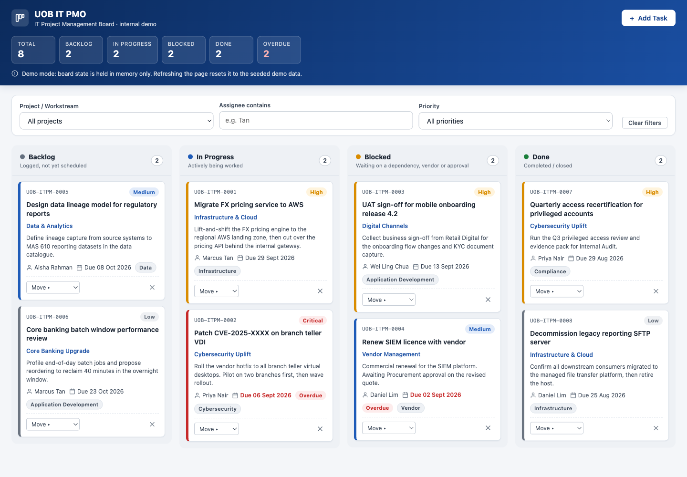

# UOB IT PMO Kanban Board

A single-page IT project management board built as an internal demo and training tool for a fictional "UOB IT PMO". Tasks move across four fixed columns (Backlog, In Progress, Blocked, Done) by drag-and-drop or a keyboard-friendly Move control, with priority colour coding, overdue badges, client-side filters, a live summary strip and a validated Add Task form that emails a notification through FormSubmit. Board state lives in memory only, so a refresh resets it to the seeded demo data by design.

This is not an official UOB system. It uses a plain text wordmark and a corporate-blue palette only.

## Live demo

https://bharathkumarbachina.github.io/Training/

## Screenshot



## Run locally

No install, build or server is needed. Clone the repo and open the file:

```sh
open index.html
```

Or double-click `index.html` in Finder / Explorer.

## Tech stack

- Vanilla HTML, CSS and JavaScript in one file. No frameworks, libraries, CDN scripts, web fonts or build step.
- Native HTML5 Drag and Drop API.
- FormSubmit AJAX endpoint for email notifications (the only network call).
- System font stack and inline SVG icons.

## Key features

- Four-column Kanban board with live task counts, side by side on desktop and stacked below 768px.
- Drag-and-drop between columns with a drop-target highlight, plus a Move select on each card for keyboard users.
- Priority colour bar and pill (Critical, High, Medium, Low) and an Overdue badge for past-due open tasks.
- Inline "Delete? Yes / No" confirmation on each card, no native dialogs.
- Add Task modal with client-side validation and inline error messages.
- Optimistic UI: the card appears immediately, the email is sent in parallel, and a failure only shows a warning toast.
- Filter bar by project, assignee and priority; header summary of totals, per-status counts and overdue count.
- Accessible: labelled inputs, visible focus rings, `aria-label` on icon buttons, polite live region for toasts.
- All user input is HTML-escaped before rendering.

## Project structure

- `index.html` — the whole app: markup, styles and script.
- `requirment.md` — the requirements the app was built against.
- `CLAUDE.md` — project notes for Claude Code (architecture, constraints, how to verify).
- `.claude/commands/publish-github.md` — the `/publish-github` slash command used to publish this repo.
- `.mcp.json` — project-scoped MCP servers (Playwright, for browser testing).
- `.github/workflows/deploy-pages.yml` — GitHub Pages deployment workflow.
- `docs/screenshot.png` — screenshot of the live site, captured with Playwright and shown above.

## Browser testing

The project includes the Playwright MCP server in `.mcp.json`, so Claude Code can drive a real browser to test the board. Approve it once when prompted on first run, then ask Claude to navigate to the site and exercise the flows. The server is fetched on demand with `npx`, so there is nothing to install.

## Configuration

Email notifications need one change. Near the top of the `<script>` block in `index.html`, set the FormSubmit endpoint to your address:

```js
const FORMSUBMIT_ENDPOINT = "https://formsubmit.co/ajax/YOUR_EMAIL@example.com";
```

FormSubmit requires a one-time activation: the first submission sends a confirmation email to that address, and notifications only deliver after the link in it is clicked. Until then the app shows a "notification failed" warning toast but the board keeps working.

## Deployment

Deployed automatically to GitHub Pages by `.github/workflows/deploy-pages.yml` on every push to `main`.
